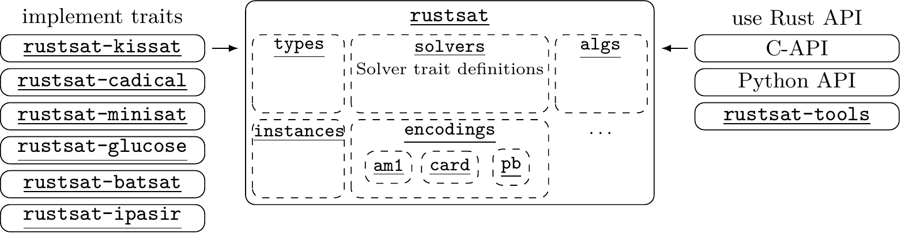
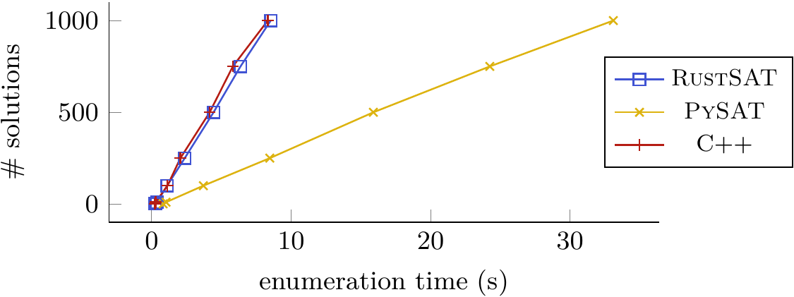
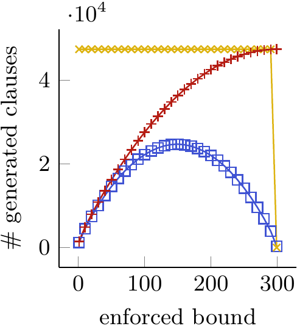
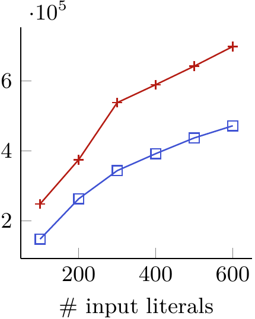
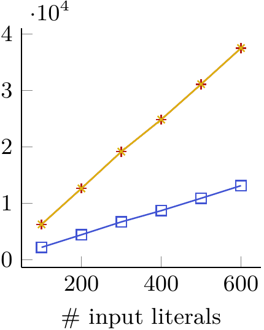
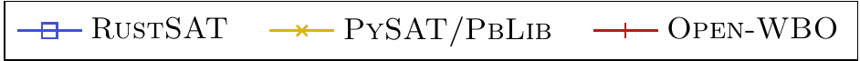

# RustSAT Benchmarks

This repository contains some simple benchmarks to compare RustSAT to similar libraries.

Library versions in this comparison

- RustSAT (v0.7.2)
- PySAT (v1.8.dev17)
- OpenWBO (v2.1)
- PBLib (as reexported in PySAT)

## RustSAT's Architecture

The general architecture of RustSAT is illustrated by the following figure.

## Solution Enumeration

We compare solution enumeration performance on the
[`AProVE11-12.cnf`](https://benchmark-database.de/file/0f27eae382e7dcd8fd956ab914083a29?context=cnf)
instance for PySAT, RustSAT and a custom C++ implementation in
[`enumerator.cpp`](enumerator.cpp).

## Encoding Size

We compare the size of produced CNF cardinality/pseudo-Boolean encodings for
RustSAT, PySAT (PBLib reexports for PB encodings), and OpenWBO.

Totalizer encoding over 300 input literals and bound varying between 0 and 300.

Generalized totalizer encoding with random input weights in \[1,100\] and
enforced bound 300 for up to 600 input literals.

Binary adder encoding with random input weights in \[1,100\] and enforced bound
300 for up to 600 input literals.

